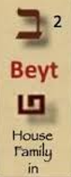
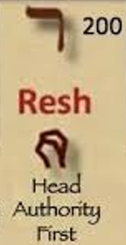
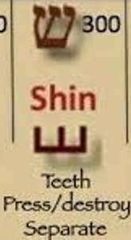
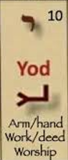
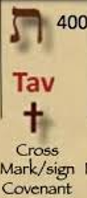

As we near to The Day, on which the reading of the Torah is began from Bereshit for the Hebrews, it is a good time to have a closer look to that Word and the Beginning as a season and pattern. The beginning is important to understand, so we can estimate the end - God likes to declare the ending already in the beginning, to show how He already knew how it all would go - there is no Glory to be snatched from His hand. 

<b>Isaiah 46:9-10</b>  
'Remember the former things of old: for I am God, and there is none else; I am God, and there is none like me, <mark>declaring the end from the beginning</mark>, and from ancient times the things that are not yet done, saying, My counsel shall stand, and I will do all my pleasure: ' 

<b>Revelation 1:8</b>  
'I am Alpha and Omega, <mark>the beginning and the ending</mark>, saith the Lord, which is, and which was, and which is to come, the Almighty. ' 

So lets have a closer look at the word in Hebrew Bible: Bereshit. Bereshit is written as Bet(B), Resh(R), Alef(A), Shin(S), Yod(J), Tav(t). Already it seems off that the first letter is not Alef, but Bet, the second letter. Is this the Father placing His Son even before Himself as the Head of the Bible, His Word? Later we, of course, get a confirmation of this as we learn that Yeshua, Jesus, IS the WORD - He IS the head of the Bible both figuratively and factually. God the Father has given Him the power of the Head of the House (Bet, Resh = Son). So <b>Father (Alef) has placed Bet, Resh (which means Son) before Himself - given the Son the Authority</b> in the <mark>First Word of the Bible</mark>! HalleluJah! 

Next letter is Shin, which looks like a W - it is the front or the teeth and on its own can mean destruction, devouring or eating. So far the word Bereshit is then BR(son) of A(God) is S(destroyed, devoured). The last two letters Yod (J, the hand) and Tav (t, the cross, the mark). Hence the whole word BRASJt becomes: <mark>The Son of God is devoured by own Hand on the Cross Sign</mark>. <b>The END was declared already in the first word</b> in the Bible. 

<h4>The Pattern of Creation</h4>

The pattern of creation is the second most remarkable pattern, right after the pattern of Redemption. A being having life in Him/Her is remarkable, but that life is only Good to be kept in Fathers house when it accepts the Creators Loving hand of salvation. ❤️

In Genesis God created the world in six (6) days, which is incomprehensible for humans for both reasons: Firstly how could something this amazing be created in such a short time? And secondly why it took so long, surely God could have created everything in an instant? So in the end we are left with the conclusion that there is something more to the pattern itself - each day was important for creation and the exact things that were creted on each day is significant.

<B>Day1</B> 
Heaven and the Earth were created. Darkness was upon the face of the deep, then God said "Let there be light" - the first words uttered by God. We know from the New Testament, that Yeshua, Jesus Christ of Nazareth IS the Word AND the Light - He came from the Father like Words came and the causal effect of those Divine Words: there was Light. And God saw the Light (Father saw the Son) that it was Good. And God divided the Light from the darkness (Crucifixion reference?). And God called Light Day and darkness He called night. Night and Day, Light was separated from the darkness already on Day1 - 5 days before humans were even created! 

<b>Day2</b> 
God creates through His Words (Yeshua, Jesus Christ of Nazareth) firmament to divide the waters from the waters - is this a allusion to the future splitting of the Red Sea for Moses and the Israelites to cross over? God called the Firmament (the divider) Heaven - is it so that the Heaven, and our safety, well-being and indeed our very lives, are DEPENDENT on God keeping that divider, firmament in place so that the huge sea walls on both sides do not engulf us, like it did the whole Egyptian army? We are only saved and indeed continue to be SAFE in God and with God. ❤️🙏🎺🎶

> In Hosea 6 it says God will <b>revive</b> us after two days. Idiomatically Israel was dead, when they were in bondage in Egypt - they could not worship God. So God brought them out of Egypt in Exodus, which in a sense matches with Day2 - the division of the Red Sea was the Firmament, which held the waters at bay and enabled the nation of Israel to be born in a day of their crossing of the sea. This is of course also an allusion to childbirth, in that when a child come out of the womb, it very much enters a new wilderness of the world as well. It is a dangerous time for the baby, but of course in 2026 it is also dangerous for a baby to be inside the womb - perhaps this is one of the reasons God has scheduled end-time to this stage of society. 🙏

<b>Day3</b> 
God makes the water to gather together and the dry land appear. God called the dry land Earth and gathering together of the waters Seas. In the Book of Revelation we learn that eventually in the end, there will no longer be sea, the chaotic wild masses - perhaps the Day3 of Creation was already hinting at this future event by lands appearance and the waters presence diminishing before their ultimate vanishing altogether.

Additionally on Day3 God made the Earth bloom with grass, herbs, seeds, trees yielding fruits. In the Bible people are referred to as being trees that yield fruits of all sorts of kinds, and by their fruits we shall know them. Some fruits are of the Spirit and some of duty and service - but ALL fruits that Glorify God are Good and He knows you, eventhough the world might not give much worth to your fruits. The dry land is not the sea and the sea does not recognize the land. But we yearn to become land, solid and stable and at-rest in our LORD and Saviour Yeshua, Jesus Christ of Nazareth.

> In Hosea 6 it says "in the third day He will raise us up, and we shall live in his sight", which very much sounds like a Rapture reference, in multiple ways - also with the aforementioned connect with day2, but also with the raising indeed up and especially on day3, just before the day4 on which Yeshua, Jesus Christ of Nazareth came and will come again? In the Pattern of creation days 3-4 and 6-7 are, perhaps, cascading in the end-time as the 6th millnium ends in a bang with Yeshua, Jesus second coming.

<b>Day4</b> 
'And God said, Let there be lights in the firmament of the heaven to divide the day from the night; and let them be for signs, and for seasons, and for days, and years: and let them be for lights in the firmament of the heaven to give light upon the earth: and it was so. ' The stars, constellations, sun, moon and nebulae were all created for signs - <b>this is why watching the Heavens is imporant when trying to determine the Season we are living in</b>. It all happened on Day4.

On Day4 we see some of the same pattern repeating as on Day1, so from Genesis1 we could already estimate and assume that the 4th millenium would be highly significant in some way - it ended up being the most significant millenium right there in the midst of the 7days, 7milleniums, creation pattern due to that Jesus, Yeshua, the Messiah came to fulfil His earthly ministry at this time and to declare Victory of Light over the power of darkness. ❤️🙏🎺🎶

  

